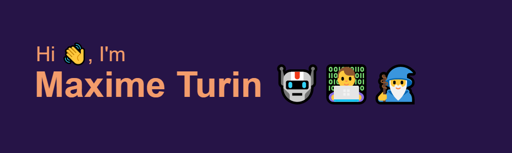

====================================================================================================================================

JavaScript Developer
--------------------

I've been learning to code for over a year after a career change. Like everyone else, I started with HTML, but I quickly fell in love with backend technologies after discovering javascript, nodeJS and SQL.  
Now, I'm looking for a company where I can develop my skills and/or acquire new ones.  

* 🌍  I'm based in France
* 🖥️  See my portfolio at [Termimax](http://termimax.surge.sh/)
* ✉️  You can contact me at [maxime.turin@gmail.com](mailto:maxime.turin@gmail.com)
* 🚀  I'm currently working on [Amical Football](http://amical-football.surge.sh/)
* 🧠  I'm learning MongoDB, GraphQL and React

### Skills

### Socials

  
  

### Badges

<b>Top Repositories</b>

       
